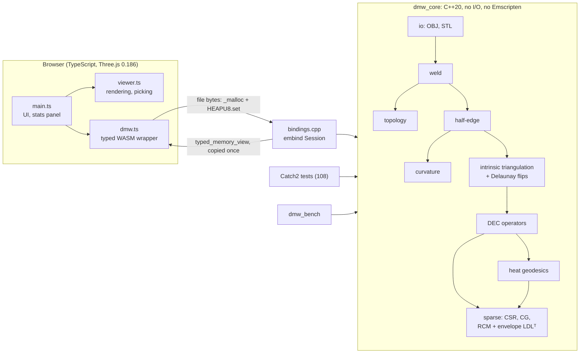

# Mesh Inspection Workbench

A C++20 geometry-processing core, compiled natively and to WebAssembly, with a Three.js viewer. It inspects
triangle meshes for topological defects and computes discrete curvature and geodesic distance, implementing
four papers and verifying each against exact identities, closed-form solutions and measured convergence.

**Live demo:** published by the GitHub Pages workflow in [`.github/workflows/ci.yml`](.github/workflows/ci.yml)
(`https://<user>.github.io/<repo>/` once the repository is pushed and Pages is set to "GitHub Actions").
All demo meshes are generated in code. Files you open in the viewer are processed locally in your browser
and never uploaded.

## What it does

| Stage | What | Reference |
|---|---|---|
| Load | OBJ and STL (binary and ASCII) parsers; vertex welding (exact, or ε-grid) | |
| Topology | Boundary, non-manifold and misoriented edges; bowtie vertices; invalid, duplicate and isolated elements; components; Euler characteristic, orientability, **genus and Betti numbers** per component | |
| Half-edge | Index-based half-edge structure; rejects non-manifold or misoriented input | |
| Curvature | Mixed Voronoi areas, cotan mean-curvature normal, angle-defect Gaussian curvature, principal curvatures | Meyer, Desbrun, Schröder, Barr 2003 |
| Distance | Heat-method geodesics on DEC operators (L = −d₀ᵀ⋆₁d₀), hand-written sparse LDLᵀ; Dijkstra baseline | Crane, Weischedel, Wardetzky 2013 |
| Handles | Homology handle loops (2g per component) via tree-cotree with the greedy shortest system of loops; boundaries capped | Eppstein 2003; Erickson & Whittlesey 2005 |
| Robustness | Intrinsic Delaunay Laplacian via intrinsic edge flips: all cotan weights ≥ 0 | Bobenko & Springborn 2007; Fisher, Springborn, Bobenko, Schröder 2007 |
| Dental scans | Cusp-tip detection by occlusal prominence; tooth-gingiva margin by concavity-weighted geodesic Voronoi; evaluated on held-out Teeth3DS / 3DTeethLand data | |
| Viewer | Overlays for defects, curvature, components, and click-to-pick geodesic isolines; cotan vs intrinsic Delaunay toggle | |

## Architecture



The core is a plain C++ library with no file I/O and no Emscripten code, so the same source builds natively
(tests, sanitizers, benchmarks) and to WebAssembly. `bindings.cpp` is the only WASM-specific C++ file.
Errors are return values, not exceptions, because Emscripten disables exception catching by default.

## Algorithms, and how each is verified

**Topology.** Edges are classified by their incident faces and directions. Components use union-find over
vertices: a bowtie is one path-connected component with a non-manifold vertex. Orientability is a
breadth-first Z₂ propagation of per-face flips; a conflict means non-orientable, like the Möbius strip.
For manifold, orientable components, g = (2 − χ − b)/2 and β = (1, 2g + b − 1 or 2g, [b = 0]).
*Verified:* closed-form χ, b, g on generated spheres, tori, disks, disks with holes and a plate with a
handle; β₀ − β₁ + β₂ = χ for every component; one test per defect class.

**Curvature (Meyer et al. 2003).** Per-face accumulation of cotangent weights and mixed areas. Angles use
atan2(|u×w|, u·w), which stays well-conditioned near 0 and π, unlike acos.
*Verified:* discrete Gauss-Bonnet Σ(angle defects) = 2πχ, to 1e-10, on closed and bounded meshes. This is an
identity, so it checks bookkeeping, not accuracy. Mixed areas tile the surface. Flat irregular meshes give
exactly zero. H flips sign with orientation while K doesn't. Accuracy is measured as convergence order 2 on
the torus and sphere against closed forms (see [DECISIONS.md](DECISIONS.md) D39).

**Heat-method geodesics (Crane et al. 2013).** Three steps: (⋆₀ − tL)u = δ with t = h², then
X = −∇u/|∇u|, then Lφ = ∇·X. Both matrices are factored once by a hand-written reverse Cuthill-McKee plus
envelope LDLᵀ, so each new source costs two triangular solves.
*Verified:* d₁d₀ = 0; div∘grad = L; the DEC Laplacian applied to positions equals −A·K(x) from the
independent curvature code (to 1e-12); convergence to great-circle distance on spheres and to Euclidean
distance on flat grids.
*Finding:* conjugate gradient cannot solve the heat step accurately at t = h². Its residual tolerance
swamps the exponentially small far-field heat, and the error grew under refinement. That is why the solver
is a direct factorization (D47).

**Intrinsic Delaunay Laplacian (Bobenko & Springborn 2007; flips per Fisher et al. 2007).** All intrinsic
geometry (areas, angles, Laplacian, gradient, divergence) is computed from edge lengths alone. Non-Delaunay
edges (cot α + cot β < 0) are flipped by unfolding their two triangles. The surface is unchanged and every
weight becomes non-negative.
*Verified:* flipped connectivity equals a from-scratch half-edge rebuild; area and every cone angle are
preserved; Euclidean lengths reproduce the extrinsic operators to 1e-12.

**Engineering checks.** The same assertions run natively (Catch2) and through the WASM build under Node
(`npm run smoke`). Tests pass at both the default and Release optimization levels. Each geometry routine was
mutation-checked by planting classic bugs and confirming the tests fail, which also found one untested
guard that now has a test (D26, D50, D56).

## Measured results

Accuracy figures are mean absolute error. Dates, settings and the full tables are in
[DECISIONS.md](DECISIONS.md) (D39, D50, D55).

| Measurement | Result |
|---|---|
| Heat geodesics vs great-circle distance, icosphere s = 2 → 6 | mean error 4.5e-2 → 6.5e-3 (Dijkstra-on-edges: ~1.2e-1 at every resolution, no convergence) |
| Curvature on the torus vs closed forms | observed order 2 for H and K |
| Obtuse "brick" grid, cotan Laplacian | heat goes negative at 446 vertices; geodesic error grows under refinement (4.3e-2 → 1.07e-1) |
| Same grid, intrinsic Delaunay | no negative heat; geodesic error converges (9.9e-3 → 5.9e-3) |
| Heavily jittered sphere, max \|H − 1\| | cotan 16 → intrinsic Delaunay 2.2 (s = 5) |

## Real intraoral scans (Teeth3DS+ / 3DTeethLand, CC BY-NC-ND 4.0, used locally)

Scans are not redistributed. Only aggregate metrics are reported, with attribution to Ben-Hamadou et al.
(Teeth3DS+) and the 3DTeethLand challenge.

| Measurement (cusps: held-out 3DTeethLand test set, 100 scans, 2,343 landmarks) | Result |
|---|---|
| Cusp tips, occlusal prominence (tuned on 67 training scans) | F1 **0.631** at 1 mm (precision 0.553, recall 0.736); median localization error **0.44 mm** |
| Naive baseline: raw mean-curvature maxima | F1 0.112 at 1 mm (200 detections per scan) |
| Scan topology (median 106k vertices) | only 9/100 arches are genus 0; handle-loop count = 2·Σg on every scan |
| Tooth-gingiva margin, concavity-weighted Voronoi (held-out Teeth3DS test split: 300 scans) | ASSD **0.551 mm** (median 0.450), HD95 3.27 mm, boundary F1 **0.815** at 0.5 mm, tooth IoU 0.841 |
| Naive baseline: plane cut at a height quantile | ASSD 1.663 mm, boundary F1 0.208 at 0.5 mm |
| + learned cusp-seed filter (logistic regression; model kept local, see D76) | ASSD **0.528 mm**, tooth IoU 0.869; paired: better on 130 scans, worse on 5 of 300 |
| + no height-band tooth seeds (D77) | ASSD 0.520 mm (median 0.409), HD95 2.95 mm; paired vs 0.551: t = −3.6, better on 178, worse on 122 of 300 |
| **+ graph-cut labelling (Boykov–Kolmogorov max-flow, D78; public operating point)** | ASSD **0.338 mm** (median 0.283), HD95 **2.34 mm**, boundary F1 **0.883** at 0.5 mm, tooth IoU **0.925**; paired vs 0.520: t = −11.5, better on 247, worse on 53 (7 by > 0.1 mm) |
| Cusp detection time, 93.6k-vertex scan | 383 ms native, 459 ms in the browser (WASM), after a 4-8× optimization (D70) |
| Margin detection time, 113.7k-vertex scan | 733 ms in the browser (WASM) with Voronoi labelling, including cusp seeding; the graph cut adds ~100 ms per scan natively (36 → 137 ms labelling, 300-scan mean); browser not yet re-measured |

## Performance

Measured 2026-10-05 on an Apple M4 (16 GB). Native: Apple clang 17, CMake Release (-O3). WASM: emsdk 6.0.11
under Node 26.10. Times in milliseconds, median of 7 runs (3 runs above 100k faces). Reproduce with the
commands in [Build and run](#build-and-run).

| Mesh | Vertices | Triangles | Load + analysis, native | Load + analysis, WASM | Heat setup, native | Heat query, native | Heat query, WASM |
|---|---:|---:|---:|---:|---:|---:|---:|
| icosphere s=3 | 642 | 1,280 | 0.69 | 1.03 | 0.75 | 0.17 | 0.22 |
| icosphere s=4 | 2,562 | 5,120 | 2.56 | 2.46 | 5.11 | 0.58 | 0.54 |
| icosphere s=5 | 10,242 | 20,480 | 9.40 | 11.2 | 65.7 | 3.40 | 3.52 |
| icosphere s=6 | 40,962 | 81,920 | 45.5 | 83.6 | 1,140 | 22.0 | 23.4 |
| icosphere s=7 | 163,842 | 327,680 | 235 | 1,020 | not run | | |

"Load + analysis" is what the viewer does on open: binary STL parse, weld, topology, half-edge build and
curvature. In WASM it also includes copying the bytes in and the results out. The native per-stage
breakdown comes from `dmw_bench`.

## Complexity

| Stage | Time | Memory |
|---|---|---|
| Parse, weld (exact) | O(n) expected (hashing) | O(n) |
| Topology, half-edge, curvature | O(n) expected; per-vertex fan sorts O(n log d) | O(n) |
| Intrinsic Delaunay flips | no known bound in general (Fisher et al.); fast in practice | O(n) |
| Heat setup (RCM + envelope LDLᵀ) | O(n · bw²), with bandwidth bw ~ √n on surfaces: ~n² | O(n · bw) ~ n^1.5 |
| Heat query | O(n · bw) ~ n^1.5 | O(n) |
| Dijkstra baseline | O(n log n) | O(n) |

## Limitations

- **Pointwise mean curvature does not converge on irregular meshes.** It does on regular ones (order 2).
  Intrinsic Delaunay reduces the blow-ups about 8× but doesn't remove the growth (D39, D55).
- **The heat-solver factorization uses envelope storage,** so memory grows ~n^1.5. Setup takes 1.1 s at
  41k vertices and was not run at 164k. A supernodal or AMD-ordered factorization (for example Eigen or
  CHOLMOD) is the upgrade path (D49).
- **The heat-method convergence rate slows at fine resolutions** (about 0.96 → 0.42 per level). The cause is
  not identified (D50).
- **WASM load + analysis is 4.3× slower than native at 164k vertices,** against ≤ 1.9× below that.
  WASM memory growth was ruled out; the cause is not identified.
- **Some intrinsic Delaunay flips are skipped.** A flip that would need a self-loop or multi-edge can't be
  represented by vertex-triple connectivity, so it is skipped and counted (1 occurrence measured, D53).
- **Signed mean curvature is undefined on non-orientable surfaces,** and the half-edge structure rejects them
  (D10). Topology diagnostics still work on any mesh.
- **Handle loops are valid generators, not the shortest in their homology class.** Their lengths are upper bounds
  on handle size (measured 3.5× the tight cycle on a synthetic handle, D64).
- **The margin still has a tail:** HD95 is 2.34 mm on average. The graph cut (D78) removed most false tooth regions
  that first-arrival Voronoi let flood the gingiva, but the margin has now been evaluated on the test split four
  times (each disclosed), so the next claim should come from fresh data.
- **"Margin" here is the tooth-gingiva boundary on unprepared arches,** not the finish line of a crown
  preparation that restoration design needs; related problems, not the same one.
- **Cusp detection over-detects on anterior teeth:** incisal edges score as tips but carry no cusp
  landmarks. It's the main precision loss, and tooth-type awareness is the next lever (D68).
- **Boundary conditions:** the heat method uses Neumann conditions only (D48).
- **OBJ polygons are fan-triangulated,** which is correct for convex polygons only (D16).
- **The bundle is 622 kB of JavaScript,** mostly Three.js, plus a 267 kB WASM module.

## Build and run

Toolchain used: CMake ≥ 3.24, a C++20 compiler (Apple clang 17 tested), emsdk **6.0.11**, Node 26.

```bash
# Native: build and run the 108 tests
cmake -S . -B build && cmake --build build -j && ctest --test-dir build --output-on-failure

# Benchmarks (Release build; also writes the meshes the WASM benchmark reads)
cmake -S . -B build-release -DCMAKE_BUILD_TYPE=Release && cmake --build build-release -j
./build-release/tools/dmw_bench build-release/bench

# WebAssembly + viewer (expects emsdk at ~/emsdk, or set EMSDK_DIR)
cd web && npm ci
npm run build:wasm    # emcmake + build, copies dmw.mjs / dmw.wasm / dmw.d.mts into src/wasm
npm run smoke         # same geometry assertions through the WASM build, under Node
npm run bench         # WASM timings on the benchmark meshes
npm run dev           # viewer at http://localhost:5173
npm run build         # static site in web/dist (relative paths)
```

## Repository layout

```
src/core/      geometry library (public headers in include/core, private helpers in detail/)
src/wasm/      embind bindings: the only Emscripten-specific C++
tests/         Catch2 tests, one file per module
tools/         dmw_bench
web/           TypeScript viewer, WASM wrapper, Node smoke test and benchmark
DECISIONS.md   every design decision, with alternatives, reasons and measurements
ROADMAP.md     milestones
```

## Data

Only synthetic meshes generated in code: spheres, tori, cylinders, grids with holes, a plate with a handle,
a Möbius strip, an obtuse "brick" grid and a defect showcase. No third-party or scanned data is included.

## References

- M. Meyer, M. Desbrun, P. Schröder, A. H. Barr. *Discrete Differential-Geometry Operators for Triangulated
  2-Manifolds.* Visualization and Mathematics III, 2003.
- K. Crane, C. Weischedel, M. Wardetzky. *Geodesics in Heat: A New Approach to Computing Distance Based on
  Heat Flow.* ACM Transactions on Graphics 32(5), 2013.
- A. I. Bobenko, B. A. Springborn. *A Discrete Laplace-Beltrami Operator for Simplicial Surfaces.* Discrete &
  Computational Geometry, 2007.
- M. Fisher, B. Springborn, A. I. Bobenko, P. Schröder. *An Algorithm for the Construction of Intrinsic
  Delaunay Triangulations with Applications to Digital Geometry Processing.* Computing 81(2/3), 2007.
- D. Eppstein. *Dynamic Generators of Topologically Embedded Graphs.* SODA 2003.
- J. Erickson, K. Whittlesey. *Greedy Optimal Homotopy and Homology Generators.* SODA 2005.
- N. Sharp, K. Crane. *A Laplacian for Nonmanifold Triangle Meshes.* Computer Graphics Forum (SGP), 2020.
  Cited as the non-manifold generalization; not implemented here.

## License

[MIT](LICENSE)
