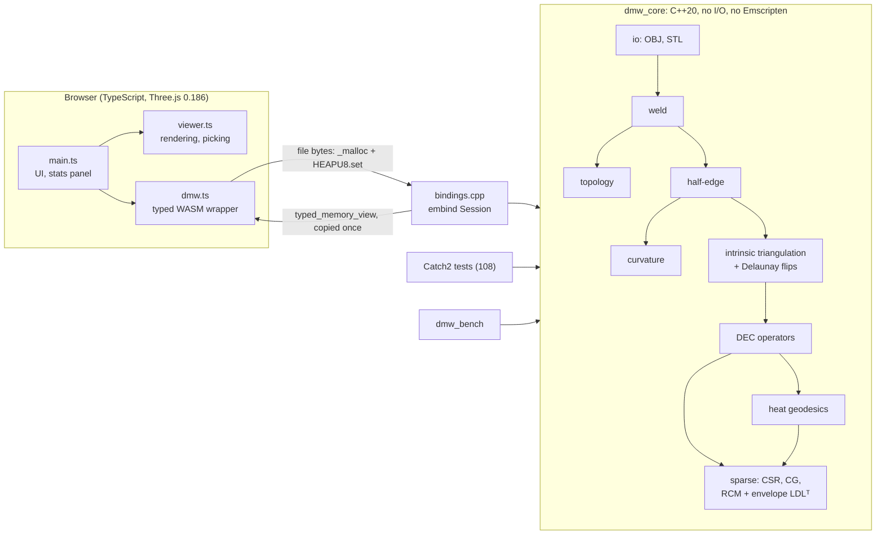

# Mesh Inspection Workbench

[](https://github.com/carlmarco/dental-mesh-workbench/actions/workflows/ci.yml)

A geometry-processing core in C++20, compiled natively and to WebAssembly, with a Three.js viewer. It started as
mesh inspection (topology, curvature, geodesics) and grew into a training-free **tooth-gingiva segmentation of
intraoral scans** plus manufacturing-oriented inspection (undercuts along a path of insertion, wall thickness).
Every algorithm is written from scratch and checked against an independent reference: closed forms, convergence
under refinement, brute force, or mutation tests.

**Headline result.** On 299 held-out Teeth3DS scans that played no part in development, the tooth-gingiva boundary
lands **0.285 mm** from the labelled one on average (ASSD; median 0.219 mm), with boundary F1 **0.906** at 0.5 mm and
tooth IoU **0.936**. The first working version measured 0.551 mm / 0.815; each step in between came from measuring
why the previous one failed ([case study](docs/CASE_STUDY.md), [all decisions](DECISIONS.md)).


*Recorded by [`web/scripts/record-demo.mjs`](web/scripts/record-demo.mjs) (headless Chromium driving the built site; captions
quote the numbers the viewer displays). The mesh is a synthetic molar generated in code (`tools/export_demo`), not a
scan.*

**Live demo: [carlmarco.github.io/dental-mesh-workbench](https://carlmarco.github.io/dental-mesh-workbench/)**,
built and deployed by CI ([`.github/workflows/ci.yml`](.github/workflows/ci.yml): native tests, WASM build, a
cross-target smoke test, then GitHub Pages). The demo meshes are generated in code. Files you open in the viewer are processed locally in your browser and
never uploaded; no dental scans are hosted (their licence does not allow it).

## How this was built

Built with an AI coding assistant (Claude Code), which wrote most of the code; commits carry its co-author line.
The author chose the problems and methods, made or approved every design decision, designed the evaluation
protocol and audited the results. Each decision, alternative and measurement is recorded in
[DECISIONS.md](DECISIONS.md), including the wrong turns, and every algorithm is checked against an independent
reference rather than trusted.

## What it does

| Stage | What | Reference |
|---|---|---|
| Load | OBJ and STL (binary and ASCII) parsers; vertex welding (exact, or ε-grid) | |
| Topology | Boundary, non-manifold and misoriented edges; bowtie vertices; invalid, duplicate and isolated elements; components; Euler characteristic, orientability, **genus and Betti numbers** per component | |
| Half-edge | Index-based half-edge structure; rejects non-manifold or misoriented input | |
| Curvature | Mixed Voronoi areas, cotan mean-curvature normal, angle-defect Gaussian curvature, principal curvatures | Meyer, Desbrun, Schröder, Barr 2003 |
| Distance | Heat-method geodesics on DEC operators (L = −d₀ᵀ⋆₁d₀), hand-written sparse LDLᵀ; Dijkstra baseline | Crane, Weischedel, Wardetzky 2013 |
| Handles | Homology handle loops (2g per component) via tree-cotree with the greedy shortest system of loops; boundaries capped | Eppstein 2003; Erickson & Whittlesey 2005 |
| Robustness | Intrinsic Delaunay Laplacian via intrinsic edge flips: all cotan weights ≥ 0 | Bobenko & Springborn 2007; Fisher, Springborn, Bobenko, Schröder 2007 |
| Optimization | s-t max-flow / min-cut; multi-label Potts energies by alpha-expansion (with optional star-shape constraints) | Boykov & Kolmogorov 2004; Boykov, Veksler & Zabih 2001; Kolmogorov & Zabih 2004; Veksler 2008 |
| Dental: cusps | Cusp tips by occlusal prominence (diffused height, non-maximum suppression) | |
| Dental: margin | Tooth-gingiva labelling: concavity-weighted geodesic seeds, graph cut with crease-aware boundary costs, then per-tooth multi-label cut | Price, Morse & Cohen 2010 (geodesic graph cut) |
| Ray casting | BVH (binned SAH), Möller–Trumbore; nearest and any-hit queries | MacDonald & Booth 1990; Wald 2007; Möller & Trumbore 1997 |
| Manufacturing | Undercut map and best path of insertion; wall thickness by ray cones | Shapira, Shamir & Cohen-Or 2008 (shape diameter function) |
| Signed distance, offsets | Generalized signed distance on a grid (robust to holes; exact DCT solves), iso-surfaces by marching tetrahedra, offset shells | Feng & Crane 2024 (signed heat method) |
| Mesh repair | Hole filling: minimum-weight triangulation (dynamic programming), refinement, thin-plate fairing; isotropic remeshing (split, collapse, flip, tangential relaxation, projection) | Liepa 2003; Barequet & Sharir 1995; Botsch & Kobbelt 2004 |
| Viewer | Overlays for defects, curvature (incl. κ<sub>min</sub> creases), components, undercuts; click-to-pick geodesic isolines; margin detection with label comparison | |

## Architecture



The core is a plain C++ library with no file I/O and no Emscripten code, so the same source builds natively
(tests, sanitizers, benchmarks) and to WebAssembly. `bindings.cpp` is the only WASM-specific C++ file.
Errors are return values, not exceptions, because Emscripten disables exception catching by default.

## Algorithms, and how each is verified

**Topology.** Edges are classified by their incident faces and directions. Components use union-find over
vertices: a bowtie is one path-connected component with a non-manifold vertex. Orientability is a
breadth-first Z₂ propagation of per-face flips; a conflict means non-orientable, like the Möbius strip.
For manifold, orientable components, g = (2 − χ − b)/2 and β = (1, 2g + b − 1 or 2g, [b = 0]).
*Verified:* closed-form χ, b, g on generated spheres, tori, disks, disks with holes and a plate with a
handle; β₀ − β₁ + β₂ = χ for every component; one test per defect class.

**Curvature (Meyer et al. 2003).** Per-face accumulation of cotangent weights and mixed areas. Angles use
atan2(|u×w|, u·w), which stays well-conditioned near 0 and π, unlike acos.
*Verified:* discrete Gauss-Bonnet Σ(angle defects) = 2πχ, to 1e-10, on closed and bounded meshes. This is an
identity, so it checks bookkeeping, not accuracy. Mixed areas tile the surface. Flat irregular meshes give
exactly zero. H flips sign with orientation while K doesn't. Accuracy is measured as convergence order 2 on
the torus and sphere against closed forms (see [DECISIONS.md](DECISIONS.md) D39).

**Heat-method geodesics (Crane et al. 2013).** Three steps: (⋆₀ − tL)u = δ with t = h², then
X = −∇u/|∇u|, then Lφ = ∇·X. Both matrices are factored once by a hand-written reverse Cuthill-McKee plus
envelope LDLᵀ, so each new source costs two triangular solves.
*Verified:* d₁d₀ = 0; div∘grad = L; the DEC Laplacian applied to positions equals −A·K(x) from the
independent curvature code (to 1e-12); convergence to great-circle distance on spheres and to Euclidean
distance on flat grids.
*Finding:* conjugate gradient cannot solve the heat step accurately at t = h². Its residual tolerance
swamps the exponentially small far-field heat, and the error grew under refinement. That is why the solver
is a direct factorization (D47).

**Intrinsic Delaunay Laplacian (Bobenko & Springborn 2007; flips per Fisher et al. 2007).** All intrinsic
geometry (areas, angles, Laplacian, gradient, divergence) is computed from edge lengths alone. Non-Delaunay
edges (cot α + cot β < 0) are flipped by unfolding their two triangles. The surface is unchanged and every
weight becomes non-negative.
*Verified:* flipped connectivity equals a from-scratch half-edge rebuild; area and every cone angle are
preserved; Euclidean lengths reproduce the extrinsic operators to 1e-12.

**Graph cuts (Boykov & Kolmogorov 2004; Boykov, Veksler & Zabih 2001).** Max-flow by the two-search-tree
algorithm; multi-label Potts energies by alpha-expansion, each move an exact s-t cut via the Kolmogorov-Zabih
construction, optionally with star-shape constraints (Veksler 2008).
*Verified:* max-flow = brute-force min cut on random graphs and = Edmonds-Karp on larger sparse ones, with the cut
value of the returned labels as a certificate; alpha-expansion never raises the energy, ends in a local minimum
over all expansion moves (exhaustive check) and stays within 2× the optimum (the Potts bound) on brute-forced
problems; star constraints hold throughout.

**Ray casting.** BVH with the binned surface-area heuristic, near-child-first traversal, Möller-Trumbore tests.
*Verified:* identical hits and distances (1e-12) to brute force on random rays over spheres, a torus and a random
triangle soup, plus axis-aligned rays from grid vertices (a zero-direction-component case random rays never hit,
which found a real slab-test bug, D92). The undercut map and wall thickness are checked on shapes with known answers:
a sphere, an overhang, tapered frusta, a slab and a spherical shell.

**Engineering checks.** The same assertions run natively (Catch2) and through the WASM build under Node
(`npm run smoke`). Tests pass at both the default and Release optimization levels. Routines are mutation-checked
by planting classic bugs and confirming the tests fail; surviving mutants led to new tests (D26, D50, D56, D85, D90),
and the harness itself was fixed when it turned out it could test a stale binary (D89).

## Measured results

Accuracy figures are mean absolute error. Dates, settings and the full tables are in
[DECISIONS.md](DECISIONS.md) (D39, D50, D55).

| Measurement | Result |
|---|---|
| Heat geodesics vs great-circle distance, icosphere s = 2 → 6 | mean error 4.5e-2 → 6.5e-3 (Dijkstra-on-edges: ~1.2e-1 at every resolution, no convergence) |
| Curvature on the torus vs closed forms | observed order 2 for H and K |
| Obtuse "brick" grid, cotan Laplacian | heat goes negative at 446 vertices; geodesic error grows under refinement (4.3e-2 → 1.07e-1) |
| Same grid, intrinsic Delaunay | no negative heat; geodesic error converges (9.9e-3 → 5.9e-3) |
| Heavily jittered sphere, max \|H − 1\| | cotan 16 → intrinsic Delaunay 2.2 (s = 5) |

## Real intraoral scans (Teeth3DS+ / 3DTeethLand, CC BY-NC-ND 4.0, used locally)

Scans are not redistributed. Only aggregate metrics are reported, with attribution to Ben-Hamadou et al.
(Teeth3DS+) and the 3DTeethLand challenge. Protocol: methods are tuned on training scans, checked on validation
scans, and only then run on the Teeth3DS test split. Test part 5 was evaluated several times during development
(each run disclosed in DECISIONS.md); test part 6 was held back and evaluated once per final method.

**Tooth-gingiva margin: how the method progressed** (ASSD = mean symmetric boundary distance; F1 at 0.5 mm;
tooth IoU area-weighted; paired = per-scan comparison with the previous row on the same scans)

| Method | Test scans | ASSD (median) | HD95 | F1 | IoU | Paired |
|---|---|---|---|---|---|---|
| Naive baseline: plane cut at a height quantile | part 5 | 1.663 mm | – | 0.208 | – | |
| Concavity-weighted geodesic Voronoi (D73) | part 5 | 0.551 (0.450) | 3.27 | 0.815 | 0.841 | |
| + no height-band tooth seeds (D77) | part 5 | 0.520 (0.409) | 2.95 | 0.819 | 0.847 | t = −3.6 |
| Graph cut, crease-aware boundary cost (D78) | part 5 | 0.338 (0.283) | 2.34 | 0.883 | 0.925 | t = −11.5, better on 247/300 |
| Graph cut, first look at fresh data (D81) | part 6 | 0.357 (0.271) | 2.37 | 0.880 | 0.927 | |
| **Per-tooth multi-label cut (D85, current)** | **part 6** | **0.285 (0.219)** | **1.98** | **0.906** | **0.936** | t = −7.3, better on 265/299 |

Supervised networks trained on ~1,400 labelled scans report gingiva IoU around 0.96 (per point, other splits);
this method reaches 0.911 per vertex with a handful of tuned parameters (D79). Things tried that did not help,
each logged with its numbers: strip carving, seed discs, island removal, a star-shape prior, a learned per-vertex
data term (D80, D85, D87, D88).

**Other measurements on scans**

| Measurement | Result |
|---|---|
| Cusp tips (held-out 3DTeethLand test set, 100 scans, 2,343 landmarks) | F1 **0.631** at 1 mm (precision 0.553, recall 0.736); median error **0.44 mm**; raw-curvature baseline F1 0.112 |
| Scan topology (median 106k vertices) | only 9/100 arches are genus 0; handle-loop count = 2·Σg on every scan |
| Undercut / best path of insertion, 263 natural crowns (D90) | undercut along the occlusal axis → best axis within 25°: incisors 23.8% → 8.0%, canines 11.9% → 1.4%, premolars 8.1% → 5.0%, molars 5.5% → 1.1% (medians) |
| Offset shells, 0.8 mm wall, same 71 crowns (D92, D95) | moving vertices along normals: thinnest wall 0.44-0.66 mm (median by tooth type); offsetting the generalized signed distance (signed heat method) instead: 0.76-0.77 mm, i.e. the nominal wall within grid error |
| Cusp detection time, 93.6k-vertex scan | 383 ms native, 459 ms in the browser (WASM), after a 4-8× optimization (D70) |
| Margin labelling time (per-tooth cut) | ~0.65-1.1 s per scan natively after a 2.6× optimization (D86), plus ~1 s of shared inputs; several seconds in the browser |
| Undercut search | 4.4× faster with coarse-to-fine + threads (D91); ray throughput ~1-4 M rays/s |
| Hole filling (Liepa 2003), D98 | 1 mm disks punched out of real crowns and filled: patch within 0.088 mm of the removed surface on average (max 0.215 mm, median over 21 scans); every filled scan remains a valid oriented manifold |
| Isotropic remeshing (Botsch & Kobbelt 2004), D99 | 10 scans at their own mean edge length: topology preserved on 10/10; 10th-percentile minimum angle 22.9° → 41.1°; edge-length CV 2.51 → 0.14; original surface within 0.006 mm mean (0.25 mm max) of the result; ~1 min per scan |

## Performance

Measured 2026-10-05 on an Apple M4 (16 GB). Native: Apple clang 17, CMake Release (-O3). WASM: emsdk 6.0.11
under Node 26.10. Times in milliseconds, median of 7 runs (3 runs above 100k faces). Reproduce with the
commands in [Build and run](#build-and-run).

| Mesh | Vertices | Triangles | Load + analysis, native | Load + analysis, WASM | Heat setup, native | Heat query, native | Heat query, WASM |
|---|---:|---:|---:|---:|---:|---:|---:|
| icosphere s=3 | 642 | 1,280 | 0.69 | 1.03 | 0.75 | 0.17 | 0.22 |
| icosphere s=4 | 2,562 | 5,120 | 2.56 | 2.46 | 5.11 | 0.58 | 0.54 |
| icosphere s=5 | 10,242 | 20,480 | 9.40 | 11.2 | 65.7 | 3.40 | 3.52 |
| icosphere s=6 | 40,962 | 81,920 | 45.5 | 83.6 | 1,140 | 22.0 | 23.4 |
| icosphere s=7 | 163,842 | 327,680 | 235 | 1,020 | not run | | |

"Load + analysis" is what the viewer does on open: binary STL parse, weld, topology, half-edge build and
curvature. In WASM it also includes copying the bytes in and the results out. The native per-stage
breakdown comes from `dmw_bench`.

## Complexity

| Stage | Time | Memory |
|---|---|---|
| Parse, weld (exact) | O(n) expected (hashing) | O(n) |
| Topology, half-edge, curvature | O(n) expected; per-vertex fan sorts O(n log d) | O(n) |
| Intrinsic Delaunay flips | no known bound in general (Fisher et al.); fast in practice | O(n) |
| Heat setup (RCM + envelope LDLᵀ) | O(n · bw²), with bandwidth bw ~ √n on surfaces: ~n² | O(n · bw) ~ n^1.5 |
| Heat query | O(n · bw) ~ n^1.5 | O(n) |
| Dijkstra baseline | O(n log n) | O(n) |

## Limitations

- **Pointwise mean curvature does not converge on irregular meshes.** It does on regular ones (order 2).
  Intrinsic Delaunay reduces the blow-ups about 8× but doesn't remove the growth (D39, D55).
- **The heat-solver factorization uses envelope storage,** so memory grows ~n^1.5. Setup takes 1.1 s at
  41k vertices and was not run at 164k. A supernodal or AMD-ordered factorization (for example Eigen or
  CHOLMOD) is the upgrade path (D49).
- **The heat-method convergence rate slows at fine resolutions** (about 0.96 → 0.42 per level). The cause is
  not identified (D50).
- **WASM load + analysis is 4.3× slower than native at 164k vertices,** against ≤ 1.9× below that.
  WASM memory growth was ruled out; the cause is not identified.
- **Some intrinsic Delaunay flips are skipped.** A flip that would need a self-loop or multi-edge can't be
  represented by vertex-triple connectivity, so it is skipped and counted (1 occurrence measured, D53).
- **Signed mean curvature is undefined on non-orientable surfaces,** and the half-edge structure rejects them
  (D10). Topology diagnostics still work on any mesh.
- **Handle loops are valid generators, not the shortest in their homology class.** Their lengths are upper bounds
  on handle size (measured 3.5× the tight cycle on a synthetic handle, D64).
- **Not state of the art in accuracy:** per vertex, the per-tooth cut reaches gingiva IoU 0.911 on part 6 (the binary
  cut 0.897 on part 5);
  supervised networks trained on ~1,400 labelled scans report ~0.964 (CrossTooth, different split). This is a
  training-free geometric method with 3 tuned parameters; see D79 for the comparison and its caveats.
- **The margin still has a tail:** HD95 is 1.98 mm on average on part 6. Part 5 was evaluated several times during
  development (each disclosed); part 6 was held back, evaluated once for the binary cut (D81) and once for the
  per-tooth cut (D85).
- **Per-tooth labelling is slower** than the binary cut: ~0.65-1.1 s of labelling per scan natively (0.2 s for the
  binary cut), several seconds in the browser on a large scan.
- **The Teeth3DS split is per jaw,** so some test patients have their other jaw in the training data (D81).
- **The undercut and thickness results are on natural crowns,** not crown preparations; the offset shells are a
  demonstration of the geometry, not restoration design (no margin, cement gap or occlusal adjustment).
- **"Margin" here is the tooth-gingiva boundary on unprepared arches,** not the finish line of a crown
  preparation that restoration design needs; related problems, not the same one.
- **Cusp detection over-detects on anterior teeth:** incisal edges score as tips but carry no cusp
  landmarks. It's the main precision loss, and tooth-type awareness is the next lever (D68).
- **Boundary conditions:** the heat method uses Neumann conditions only (D48).
- **OBJ polygons are fan-triangulated,** which is correct for convex polygons only (D16).
- **The bundle is 622 kB of JavaScript,** mostly Three.js, plus a 267 kB WASM module.

## Build and run

Toolchain used: CMake ≥ 3.24, a C++20 compiler (Apple clang 17 tested), emsdk **6.0.11**, Node 26.

```bash
# Native: build and run the tests (187)
cmake -S . -B build && cmake --build build -j && ctest --test-dir build --output-on-failure

# Benchmarks (Release build; also writes the meshes the WASM benchmark reads)
cmake -S . -B build-release -DCMAKE_BUILD_TYPE=Release && cmake --build build-release -j
./build-release/tools/dmw_bench build-release/bench

# WebAssembly + viewer (expects emsdk at ~/emsdk, or set EMSDK_DIR)
cd web && npm ci
npm run build:wasm    # emcmake + build, copies dmw.mjs / dmw.wasm / dmw.d.mts into src/wasm
npm run smoke         # same geometry assertions through the WASM build, under Node
npm run bench         # WASM timings on the benchmark meshes
npm run dev           # viewer at http://localhost:5173
npm run build         # static site in web/dist (relative paths)
```

## Repository layout

```
src/core/      geometry library (public headers in include/core, private helpers in detail/)
src/wasm/      embind bindings: the only Emscripten-specific C++
tests/         Catch2 tests, one file per module
tools/         dmw_bench, scan_qa, cusp_eval, margin_eval, margin_analyze, seed_train, vertex_train,
               undercut_eval, thickness_eval (evaluation tools; scans are read from a local data/ folder)
web/           TypeScript viewer, WASM wrapper, Node smoke test and benchmark
DECISIONS.md   every design decision, with alternatives, reasons and measurements
ROADMAP.md     milestones
```

## Data

The repository and the demo contain only meshes generated in code (spheres, tori, cylinders, grids with holes, a
plate with a handle, a Möbius strip, an obtuse "brick" grid, a defect showcase). The dental results were computed
locally on Teeth3DS+ / 3DTeethLand (CC BY-NC-ND 4.0); those scans, anything derived from them, and the two small
trained models are not redistributed. To reproduce, download the dataset into `data/` (git-ignored) and run the
tools in `tools/`.

## References

- M. Meyer, M. Desbrun, P. Schröder, A. H. Barr. *Discrete Differential-Geometry Operators for Triangulated
  2-Manifolds.* Visualization and Mathematics III, 2003.
- K. Crane, C. Weischedel, M. Wardetzky. *Geodesics in Heat: A New Approach to Computing Distance Based on
  Heat Flow.* ACM Transactions on Graphics 32(5), 2013.
- A. I. Bobenko, B. A. Springborn. *A Discrete Laplace-Beltrami Operator for Simplicial Surfaces.* Discrete &
  Computational Geometry, 2007.
- M. Fisher, B. Springborn, A. I. Bobenko, P. Schröder. *An Algorithm for the Construction of Intrinsic
  Delaunay Triangulations with Applications to Digital Geometry Processing.* Computing 81(2/3), 2007.
- D. Eppstein. *Dynamic Generators of Topologically Embedded Graphs.* SODA 2003.
- J. Erickson, K. Whittlesey. *Greedy Optimal Homotopy and Homology Generators.* SODA 2005.
- N. Sharp, K. Crane. *A Laplacian for Nonmanifold Triangle Meshes.* Computer Graphics Forum (SGP), 2020.
  Cited as the non-manifold generalization; not implemented here.
- Y. Boykov, V. Kolmogorov. *An Experimental Comparison of Min-Cut/Max-Flow Algorithms for Energy Minimization in
  Vision.* IEEE TPAMI 26(9), 2004.
- Y. Boykov, O. Veksler, R. Zabih. *Fast Approximate Energy Minimization via Graph Cuts.* IEEE TPAMI 23(11), 2001.
- V. Kolmogorov, R. Zabih. *What Energy Functions Can Be Minimized via Graph Cuts?* IEEE TPAMI 26(2), 2004.
- B. L. Price, B. Morse, S. Cohen. *Geodesic Graph Cut for Interactive Image Segmentation.* CVPR 2010.
- O. Veksler. *Star Shape Prior for Graph-Cut Image Segmentation.* ECCV 2008.
- V. Gulshan, C. Rother, A. Criminisi, A. Blake, A. Zisserman. *Geodesic Star Convexity for Interactive Image
  Segmentation.* CVPR 2010.
- T. Möller, B. Trumbore. *Fast, Minimum Storage Ray-Triangle Intersection.* Journal of Graphics Tools 2(1), 1997.
- J. D. MacDonald, K. S. Booth. *Heuristics for Ray Tracing Using Space Subdivision.* The Visual Computer 6(3), 1990.
- I. Wald. *On Fast Construction of SAH-based Bounding Volume Hierarchies.* IEEE Symposium on Interactive Ray
  Tracing, 2007.
- M. Botsch, L. Kobbelt. *A Remeshing Approach to Multiresolution Modeling.* Eurographics Symposium on Geometry
  Processing, 2004.
- C. Ericson. *Real-Time Collision Detection.* Morgan Kaufmann, 2005 (closest point on a triangle, 5.1.5).
- P. Liepa. *Filling Holes in Meshes.* Eurographics Symposium on Geometry Processing, 2003.
- G. Barequet, M. Sharir. *Filling Gaps in the Boundary of a Polyhedron.* Computer Aided Geometric Design 12(2), 1995.
- N. Feng, K. Crane. *A Heat Method for Generalized Signed Distance.* ACM Transactions on Graphics 43(4), 2024.
- L. Shapira, A. Shamir, D. Cohen-Or. *Consistent Mesh Partitioning and Skeletonisation Using the Shape Diameter
  Function.* The Visual Computer 24(4), 2008.
- A. Ben-Hamadou et al. *Teeth3DS: a Benchmark for Teeth Segmentation and Labeling from Intra-oral 3D Scans.*
  arXiv:2210.06094 (Teeth3DS+ dataset, CC BY-NC-ND 4.0), and the 3DTeethLand challenge (MICCAI 2024).

## License

[MIT](LICENSE)
